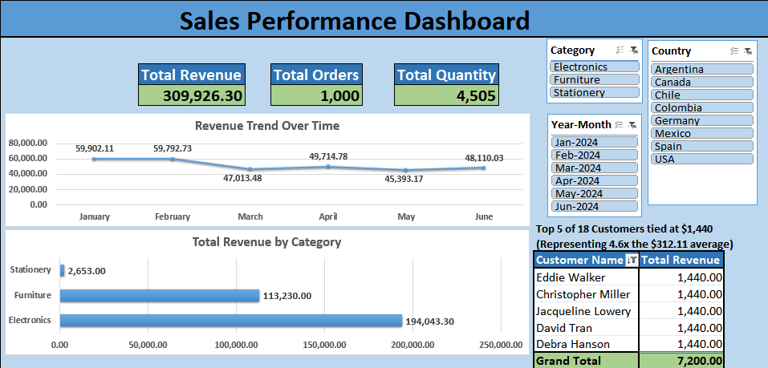

# Sales Performance Dashboard – Excel & Power Pivot

---

## Business Problem

A retail company needs visibility into its overall sales performance.  
Management wants to:

- Monitor total revenue and order volume
- Identify sales trends over time
- Understand which product categories drive performance
- Determine the top contributing customers
- Analyze results dynamically by month, category, and country

The objective of this project was to build an interactive Excel dashboard that transforms raw transactional data into executive-level insights.

---

## Dataset

The dataset consists of 1,000 simulated sales transactions designed to replicate a realistic retail environment.

**Fields included:**

- Order ID  
- Order Date  
- Customer Name  
- Country  
- Product Category  
- Quantity  
- Unit Price  

The data was programmatically generated to simulate structured transactional sales data.

---

## Methodology

### Data Preparation (Power Query)

- Imported CSV data into Excel  
- Ensured data types were correct 
- Validated date formats  
- Prepared structured fact table for modeling  

---

### Data Modeling (Power Pivot)

- Loaded data into the Excel Data Model  
- Created calculated Revenue column
- Created calculated time intelligence columns:
  - Year
  - Month
  - Year-Month  
- Developed DAX measures:
  - **Total Revenue** = `SUM(Revenue)`
  - **Total Orders** = `COUNT(Order ID)`
  - **Total Quantity** = `SUM(Quantity)`

---

### Dashboard Development

Built a single-page interactive dashboard including:

- Summary section (Revenue, Orders, Quantity)
- Revenue trend over time (Line Chart)
- Revenue by Category (Bar Chart)
- Top 5 Customers by Revenue
- Dynamic slicers for:
  - Year-Month
  - Category
  - Country

The layout was designed for clarity, hierarchy, and executive readability.

---

## Key Insights

- Revenue trends highlight a plateau in February, while showing a decline in following months, with slight fluctuations during the March-June period.
- Total revenue of $309,926.30 is driven by a highly competitive top tier, featuring 18 customers tied at a $1,440 ceiling. While the dashboard highlights a representative top 5, this entire leading group performs 4.6x higher than the store-wide average of $312.11. Of those customers, a large volume originate specifically from Colombia and Chile, and 100% of said customers have purchased Electronics.
- Products from the Electronic category vastly outperform Furniture, while Stationery represents a negligible fraction of total sales.

---

## Skills Demonstrated

- Microsoft Excel
- Power Query (ETL)
- Power Pivot (Data Modeling)
- DAX (Measures & Aggregations)
- Interactive Dashboard Design 
- Business-Oriented Data Presentation

---

## What This Project Demonstrates

This project demonstrates the ability to:

- Transform raw transactional data into a structured analytical model  
- Develop meaningful KPIs using DAX  
- Design clean, executive-ready dashboards in Excel  
- Deliver interactive reporting solutions for business decision-making  

---

